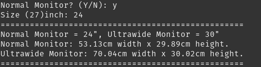
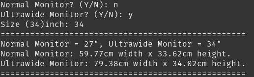

# monitor-comparison

Have you ever wonder which monitor to choose from two different monitor ratio such as 16:9 and 21:9?

Let's say you already own 24 inch 16:9 monitor and you want to buy 21:9 ultrawide monitor, you want to have the height of both monitors to have at least around the same size. What size should you use for Ultrawide Monitor for 24 inch monitor?

>This **monitor-comparison** is used to compare monitor 16:9 (normal), 21:9 (ultrawide) to have the same height size feature.

## Table of contents

- [monitor-comparison](#monitor-comparison)
  - [Table of contents](#table-of-contents)
  - [General info](#general-info)
  - [Screenshot](#screenshot)
    - [Normal Monitor](#normal-monitor)
    - [Ultrawide Monitor](#ultrawide-monitor)
  - [Launch](#launch)
  - [Status](#status)
  - [Contact](#contact)

## General info

The purpose of this project is to help people deciding which monitor size to use which has different ratios. This idea comes up when I want to buy ultrawide monitor but I want the monitor have the same height to the normal monitor. Not exactly the same height.

## Screenshot

### Normal Monitor

### Ultrawide Monitor

## Launch

- Clone this project
- Open it
- Open in your terminal window
- type: `./run.sh`

## Status

Project is: _working_ but feel free to contribute to the development.

## Contact

Created by [Hardimas Tri Saputra](mailto:ksy.group.io@gmail.com?subject=[GitHub]%20monitor-comparison) - contact me anytime!
